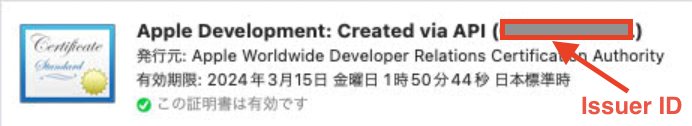

# delete-code-signing-github-action


This action removes installed certificates.
Certificates can be identified by specifying a search target.
If you do not specify a building target, all certificates are subject to deletion.

There are three search parameters

- `type`: Either `Development` or `Distribution`.
- `publisher`: Specify the name of the publisher.
- `issuer-id`: Specify the issuer ID.

Searches are performed using AND conditions.
For example, if `type` and `publisher` are specified, certificates matching both `type` and `publisher` will be targeted.

## Usage

### Example of deleting all

```yml
- uses: akiojin/delete-code-signing-github-action@v0.1.0
```

### Example of searching by certificate type and issuer

```yml
- uses: akiojin/delete-code-signing-github-action@v0.1.0
  with:
    type: Development
    publisher: Akio Jinsenji
```

## Arguments

### Inputs

| Name        | Required | Type     | Description                                                                      |
| ----------- | -------- | -------- | -------------------------------------------------------------------------------- |
| `type`      | `false`  | `string` | Specify the type of certificate. Possible options are: Development, Distribution |
| `publisher` | `false`  | `string` | Specify the name of the issuer if the issuer is the target of the search.        |
| `issuer-id` | `false`  | `string` | Specify the issuer identifier when the search is for the issuer identifier.      |

#### How to check `issuer-id

The `issuer-id` can be found in the keychain access.



> __**NOTE**__
> If no argument is specified, there is no search filter, so all certificates are included.

## License

Any contributions made under this project will be governed by the [MIT License](https://github.com/akiojin/delete-code-signing-github-action/blob/main/LICENSE).
